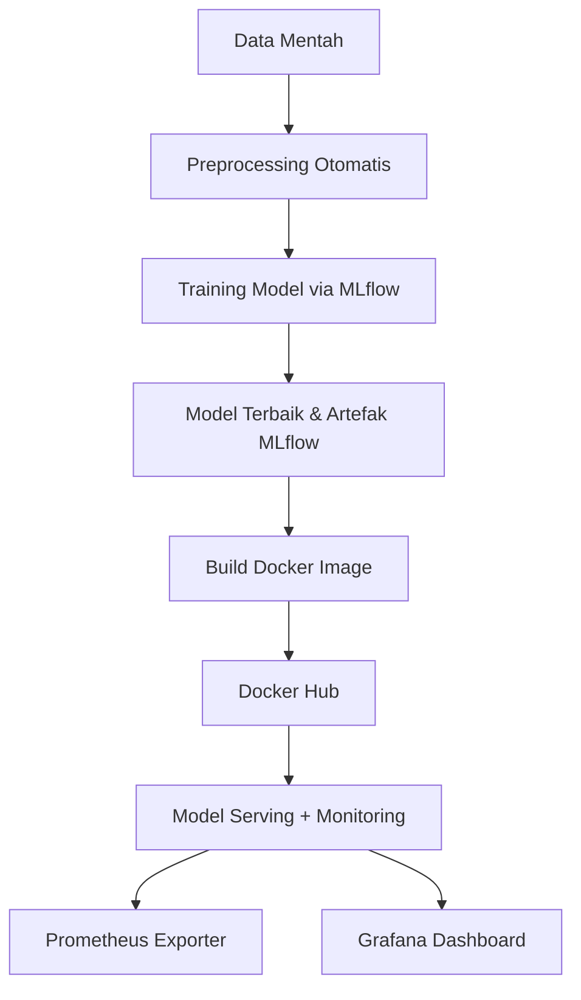

# 📦 SMSML: Smart Machine Learning Project for Personality Classification

## 🚀 Overview

SMSML adalah proyek end-to-end Machine Learning yang mencakup seluruh siklus pengembangan model, mulai dari preprocessing data mentah hingga monitoring model yang sudah dideploy. Proyek ini menggunakan GitHub Actions untuk otomatisasi CI/CD, MLflow untuk tracking eksperimen, Docker untuk deployment, dan Prometheus + Grafana untuk monitoring.

---

## 📁 Struktur Folder

```
SMSML/
├── Eksperimen.txt
├── Membangun_model/
│   ├── modelling.py
│   ├── modelling_tuning.py
│   ├── namadataset_preprocessing/
│   ├── screenshoot_dashboard.jpg
│   ├── screenshoot_artifak.jpg
│   ├── requirements.txt
│   └── DagsHub.txt
├── Workflow-CI.txt
├── Monitoring dan Logging/
│   ├── 1.bukti_serving/
│   ├── 2.prometheus.yml
│   ├── 3.prometheus_exporter.py
│   ├── 4.bukti monitoring Prometheus/
│   └── 5.bukti monitoring Grafana/
```

---

## 🔁 1. Preprocessing Otomatis

Menggunakan GitHub Actions untuk membersihkan data mentah menjadi dataset siap training.

* File: `automate_Permata-Ayu-Rahmawati.py`
* Output: `personality.csv`
* CI Workflow: otomatis dijalankan saat ada `push` ke `main`
* Link akses : https://github.com/permataa/Eksperimen_SML_Permata-Ayu-Rahmawati
* Github action : https://github.com/permataa/Eksperimen_SML_Permata-Ayu-Rahmawati/actions/runs/15618509002/job/43997250560

---

## 🧠 2. Training dan Tracking Model

Model dilatih menggunakan MLflow, dengan dua skenario:

* `modelling.py` → pipeline final
* `modelling_tuning.py` → hyperparameter tuning

Tracking dilakukan menggunakan:

* MLflow UI (lokal)
* DagsHub : https://dagshub.com/permataa/personality-prediction/experiments

---

## ⚙️ 3. Workflow CI/CD

Pipeline GitHub Actions akan:

1. Setup environment
2. Jalankan training via MLflow
3. Commit artefak MLflow (`mlruns/`)
4. Build Docker image dari model terbaik
5. Push image ke Docker Hub

* Link akses : https://github.com/permataa/Workflow-CI
* Github action : https://github.com/permataa/Workflow-CI/actions/runs/15785426564
* Docker Hub : https://hub.docker.com/r/iddokerku/personality-classification/tags
  
Secrets yang diperlukan:

* `DOCKER_USERNAME`
* `DOCKER_PASSWORD`
---

## 🖥️ 4. Deployment dan Monitoring

Model yang sudah dibuat di-**serve** dan dimonitor dengan:

* **Prometheus** → menarik metrik dari model
* **Grafana** → menampilkan metrik secara visual
* `prometheus_exporter.py` → endpoint monitoring custom

Dokumentasi dan screenshot tersedia di folder `Monitoring dan Logging/`

---

## 📸 Dokumentasi Visual

* `screenshoot_dashboard.jpg`: 

* `screenshoot_artifak.jpg`: 


* Folder `bukti_serving/` hingga `Grafana/`: 


---

## 📌 Teknologi yang Digunakan

* Python 3.10 / 3.12
* Pandas, Scikit-learn
* MLflow
* Docker
* GitHub Actions
* Prometheus & Grafana
* DagsHub

---

## 🧩 Diagram Alur Proyek



---

## 🙌 Kontribusi dan Kontak

Proyek ini dikerjakan secara mandiri oleh \Permata Ayu
